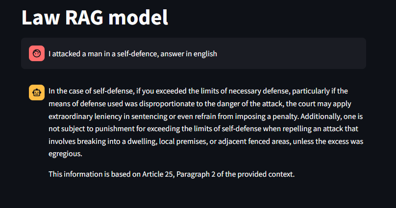
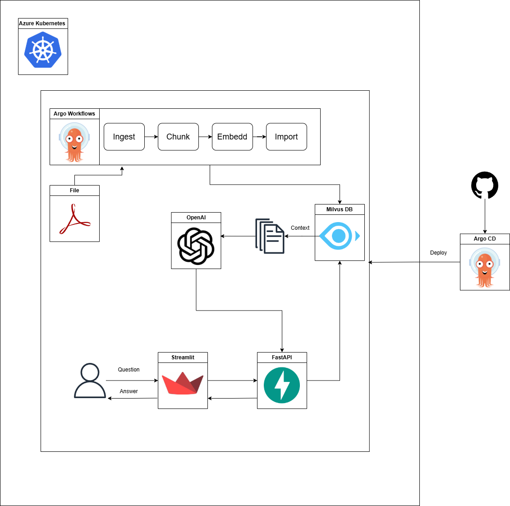

# RAGlaw Project Documentation 

## Overview  
**RAGlaw** is a Retrieval-Augmented Generation (RAG) system designed to interpret and respond to questions based on the Polish Penal Code. It uses the **GPT-4o Mini** language model to generate contextually relevant answers, with information retrieved from a vector database. The solution is fully containerized and deployed on **Azure Kubernetes Service (AKS)** for scalability and ease of maintenance.




## Architecture


## Main components 

### rag-api
The 'rag-api' is API written in FastAPI that is serving as a backend service for the RAG communication. It consists of one POST Endpoint that retrieves the relevant context in Milvus DB, feeds it into LLM and returns the LLM answer based on that context

### frontend
The 'frontend' is streamlit application that communicates with the rag-api and provide user-friendly interface to chat with RAG model

### ingesting
The 'ingesting' is Argo Workflows's workflow that chunks Polish's Penal Code, embedds it and stores the embeddings in Milvus Vector Database

### kubernetes
Application is designed to run on kubernetes' pods 

### terraform
Azure Kubernetes Cluster (AKS) is deployed using terraform 

## Getting Started

### Prerequisites
- [Terraform](https://www.terraform.io/downloads.html) installed
- [Azure CLI](https://docs.microsoft.com/en-us/cli/azure/install-azure-cli) installed
- [kubectl](https://kubernetes.io/docs/tasks/tools/install-kubectl/) installed
- [Helm](https://helm.sh/docs/intro/install/) installed
- valid Azure subscription

### Deployment Steps

1. **Terraform Deployment**
   - Navigate to the `terraform` directory.
   - Create terraform.tfvars file and assign values
     ```sh
     resource_group_name     = "law-rag-model-rg"
     resource_group_location = "West US"
     aks_name                = "law-rag-model-aks"
     dns_prefix              = "law-rag-model-dns"
     node_count              = 1
     vm_size                 = "Standard_B2s"
     os_disk_size_gb         = 32
     subscription_id         = "<YOUR_SUBSCRIPTION_ID>"
     ```
   - Initialize Terraform:
     ```sh
     terraform init
     ```
   - Apply the Terraform configuration to deploy the AKS cluster:
     ```sh
     terraform apply
     ```

2. **Application Deployment**
   - Navigate to the [deploy](http://_vscodecontentref_/1) directory.
   - Use Helm to deploy the application:
     ```sh
     helm install <release-name> ./helm-chart
     ```
   - Alternatively, apply the Kubernetes YAML files:
     ```sh
     kubectl apply -f sample.yaml -n namespace
     ```
